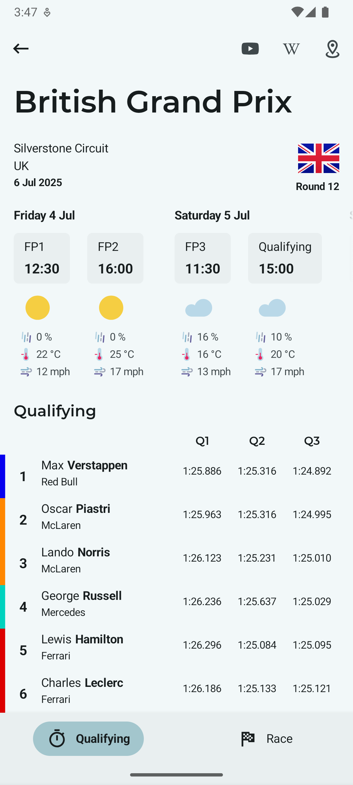
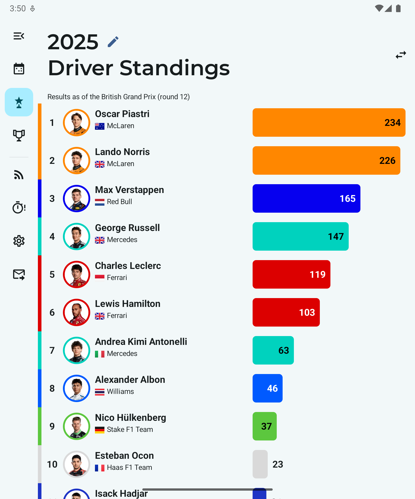
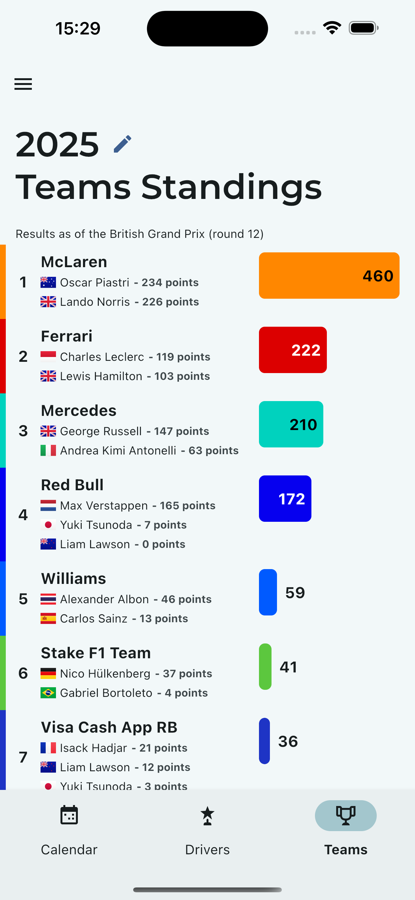

<p align="center">
  
</p>

<h1 align="center">Flashback</h1>

<p align="center">
  <a href="https://play.google.com/store/apps/details?id=tmg.flashback"></a>
  <a href="https://apps.apple.com/us/app/flashback-formula-results/id6748612648"></a>
  <a href="https://flashback.pages.dev"></a>
  <a href="https://github.com/thementalgoose/kmp-flashback/actions"></a>
</p>

Flashback provides race results and statistics from every race in the history of Formula 1 and the latest Formula 1 news from around the web!

### Screenshots

<details>
<summary><h5>Android</h5></summary>

| |                                                                               |                                                                               |                                                                               |                                                                               |                                                                               |                                                                               |                                                                               |
|---|-------------------------------------------------------------------------------|-------------------------------------------------------------------------------|-------------------------------------------------------------------------------|-------------------------------------------------------------------------------|-------------------------------------------------------------------------------|-------------------------------------------------------------------------------|-------------------------------------------------------------------------------|
|  |  |  |  |  |  |  |  |

| |                                                                                  |                                                                                  |                                                                                  |                                                                                  |                                                                                  |
|---|----------------------------------------------------------------------------------|----------------------------------------------------------------------------------|----------------------------------------------------------------------------------|----------------------------------------------------------------------------------|----------------------------------------------------------------------------------|
|  |  |  |  |  |  |

|                                                                                   |                                                                                   |                                                                                   |                                                                                   |
|-----------------------------------------------------------------------------------|-----------------------------------------------------------------------------------|-----------------------------------------------------------------------------------|-----------------------------------------------------------------------------------|
|  |  |  |  |

</details>
<details>
<summary><h5>iOS</h5></summary>

| |                                                                            |                                                                            |                                                                            |                                                                            |                                                                            |                                                                            |                                                                            |
|---|----------------------------------------------------------------------------|----------------------------------------------------------------------------|----------------------------------------------------------------------------|----------------------------------------------------------------------------|----------------------------------------------------------------------------|----------------------------------------------------------------------------|----------------------------------------------------------------------------|
|  |  |  |  |  |  |  |  |

| |                                                                          |                                                                          |                                                                          |                                                                          |
|---|--------------------------------------------------------------------------|--------------------------------------------------------------------------|--------------------------------------------------------------------------|--------------------------------------------------------------------------|
|  |  |  |  |  |

</details>

### Play Store

Flashback provides race results and statistics from every race in the history of Formula 1 and the latest Formula 1 news from around the web!

Flashback features include:
- Race results up to the latest race
- Qualifying results up to the latest race
- Sprint race results for 2021 and 2022 season
- Sprint shootout and sprint race results up to the latest race
- Driver information
- Team championship points for a race
- Driver championship standings for a season
- Team championship standings for a season
- Configurable RSS feed for Formula 1 updates
- Driver and Teams season overview

We also have an RSS hub where you can configure RSS feeds for Formula 1 news!

We plan to keep adding new features and statistics, if you have any suggestions that you would like to see please submit a suggestion from the settings in the app!

When the season is underway, the calendar for the current year might be subject to change as races are cancelled or rescheduled. As such, data may fail to appear in the app after a race has completed or the upcoming calendar event may not be accurate. We will endeavour to get this resolved as soon as possible!

Data is provided by the Flashback team. Historical data for 2023 and before was provided in part by the Ergast API, thanks to them for making this app possible! This service has been retired and is no longer available

Flashback includes quick links for Formula 1 RSS feeds from autosport.com, crash.net, motorsport.com, pitpass.com, f1-fansite.com, bbc.co.uk, theguardian.com, wtf1.com, grandprix247.com, f1i.com, and f1technical.net, but is not affiliated with them in any way

Flashback is also not affiliated in any way with any of the Formula One group of companies: FORMULA 1, FIA FORMULA ONE and related trademarks of Formula One Licensing BV

Contact Email: thementalgoose@gmail.com

### Project setup notes

```bash
# iOS
cd iosApp/
pod install
# To Release
fastlane build_upload_testflight
```